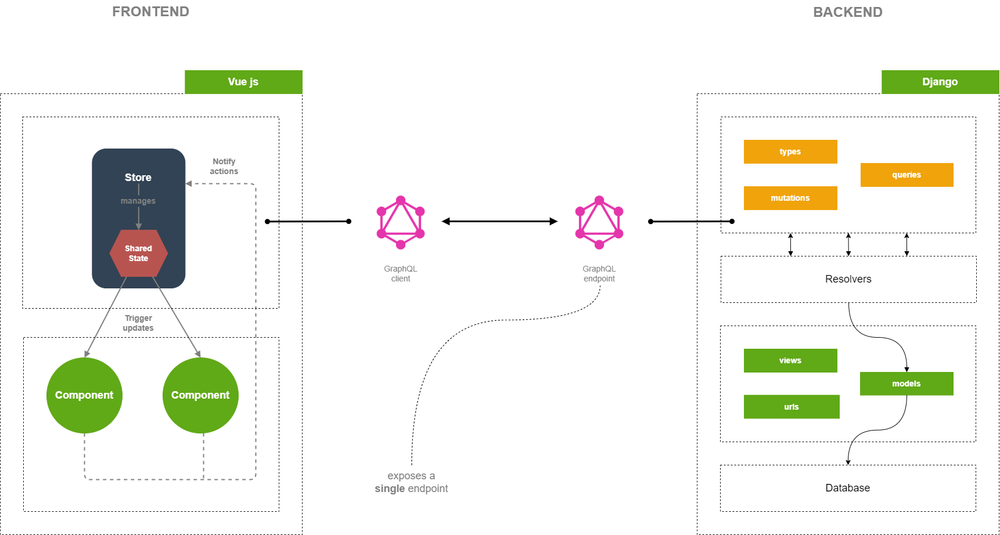
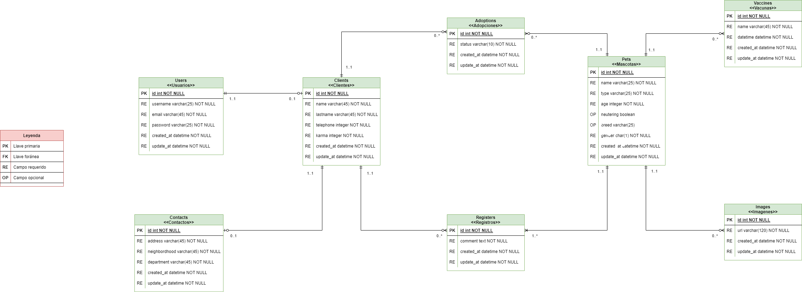

# Backend

Backend de la aplicación a desarrollar para la materia Proyecto 2

---

## Tecnologías

- [Django](https://www.djangoproject.com/)
- [GraphQL](https://graphene-python.org/)

---

## Extensiones para Visual Studio Code

- [Python](https://marketplace.visualstudio.com/items?itemName=ms-python.python)
- [Pylance](https://marketplace.visualstudio.com/items?itemName=ms-python.vscode-pylance)
- [Editor Config](https://marketplace.visualstudio.com/items?itemName=EditorConfig.EditorConfig)
- [Indent Rainbow](https://marketplace.visualstudio.com/items?itemName=oderwat.indent-rainbow)
- [Better Comments](https://marketplace.visualstudio.com/items?itemName=aaron-bond.better-comments)

---

## Variables de entorno

Después de descargar el proyecto, puede configurar las variables de entorno en su sistema operativo o actualizar el archivo ```settings.py``` por valores fijos.

### Variables a cambiar

```python
DEBUG = True
SECRET_KEY = "ejemplo123"
```

---

## Pasos para ejecutar la aplicación

1. Se recomienda utilizar **Python 3.6** o superior
2. Se recomienda utilizar [entornos virtuales](https://docs.python.org/es/3/tutorial/venv.html) con el comando ```python -m venv venv```
3. Instalar las dependencias contenidas en **requirements.txt** usando el comando `pip install -r requirements.txt`
4. Ejecutar el archivo **manage.py** con `python manage.py makemigrations`
5. Ejecutar el archivo **manage.py** con `python manage.py migrate`
6. Ejecutar el archivo **manage.py** con `python manage.py runserver`
7. Abrir el navegador e ir a la dirección <http://localhost:8000/> or <http://127.0.0.1:8000/>

---

## Diagramas

Diagrama realizado con la aplicación **Drawio**
- [Online](https://app.diagrams.net/)
- [Desktop](https://www.diagrams.net/)

### Arquitectura



### Base de Datos


---

## API GraphQL

Para iniciar la interfaz gráfica de Graph*i*QL, ir a la dirección <http://localhost:8000/graphql> o <http://127.0.0.1:8000/graphql>

### Queries

```
query consultarEjemplos {
  allExamples {
    edges {
      node {
        id
        name
      }
    }
  }
}
```
